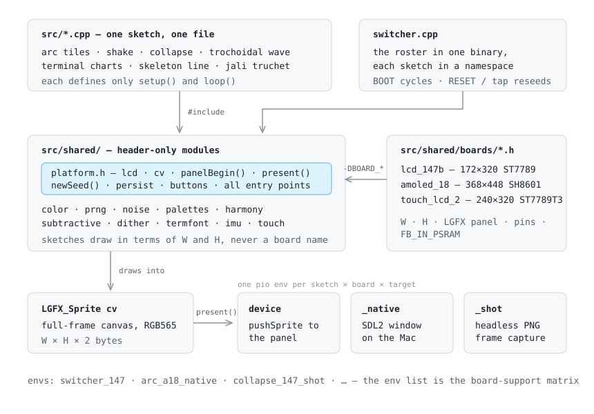

# sketchbook-esp32

A generative-art sketchbook for small ESP32-S3 display boards. Pieces are
written in the spirit of [canvas-sketch](https://github.com/mattdesl/canvas-sketch) /
p5 and ported to C++ on [LovyanGFX](https://github.com/lovyan03/LovyanGFX), so
a composition prototyped in JavaScript reproduces bit-for-bit on a board that
fits in your palm.

Nothing regenerates on a timer. A composition holds until you ask for another —
RESET (or a tap on a touch board) reseeds the piece you're on, BOOT cycles to
the next one.

## Architecture



Three ideas carry the whole repo:

1. **One sketch, one `.cpp`, one translation unit.** A sketch defines only
   `setup()` and `loop()`; everything else — the panel, the canvas sprite, the
   seeded PRNG, color science, the IMU — comes from header-only modules in
   `src/shared/`. PlatformIO's `build_src_filter` picks exactly one file per
   environment.

2. **Boards are an axis, not a rewrite.** A board is a single header in
   `src/shared/boards/` supplying `W`/`H`, the panel class, pins, and where
   the framebuffer lives. Sketches never mention a board — they draw in terms
   of `W` and `H`. An environment named `<sketch>_<board>` composes the two,
   and a sketch only gets envs for a board once it actually composes well at
   those dimensions: **the env list is the support matrix.**

3. **The desktop is the test loop.** Every sketch also builds as a native SDL2
   window (iterate in seconds, not flash cycles) and as a headless binary that
   writes PNG frames to disk — which is how a port gets _checked_, not just
   eyeballed.

## The sketches

| Sketch                 | Motion                                        |
| ---------------------- | --------------------------------------------- |
| `main.cpp` — arc tiles | still                                         |
| `arc_tiles_shake.cpp`  | still; shaking the board redraws it           |
| `collapse.cpp`         | animated, 6s loop                             |
| `trochoidal_wave.cpp`  | animated, 4s loop                             |
| `terminal_charts.cpp`  | animated, 8s scroll loop                      |
| `skeleton_line.cpp`    | animated, 8s loop                             |
| `jali_truchet.cpp`     | still; tilt slides the lattice, shake redraws |
| `switcher.cpp`         | hosts the roster in one binary; BOOT cycles   |

## The boards

| Tag   | Board                                    | Panel                                                                |
| ----- | ---------------------------------------- | -------------------------------------------------------------------- |
| `147` | Waveshare ESP32-S3-LCD-1.47B             | 172×320 ST7789 IPS, SPI                                              |
| `a18` | Waveshare ESP32-S3-Touch-AMOLED-1.8 (V2) | 368×448 AMOLED, QSPI, CST820 touch                                   |
| `t2`  | Waveshare ESP32-S3-Touch-LCD-2           | 240×320 ST7789T3 IPS, SPI, CST816D touch                             |
| `rk`  | ELECROW CrowPanel 1.28" HMI Rotary       | 240×240 round GC9A01 IPS, SPI, CST816D touch, 30-detent encoder ring |

All four are ESP32-S3R8 (dual-core LX7, 8MB octal PSRAM, 16MB flash).

## Running things

```bash
pio run -e arc_147_native -t exec        # build + run in an SDL2 window
scripts/flash.sh arc_147                 # build + flash the board
pio device monitor -b 115200             # serial output

pio run -e collapse_147_shot             # headless capture build…
.pio/build/collapse_147_shot/program OUTDIR SEED FRAMES   # …then run it
```

Substitute any `<sketch>_<board>` pair from the tables above. Native builds
need `sdl2` from Homebrew; device builds pull the espressif32 toolchain on
first run.

If the board won't flash: hold **BOOT**, tap **RESET**, release **BOOT**.

## Layout

```
src/
  *.cpp              the sketches (one per piece)
  board_diag.cpp     bringup diagnostic: geometry ruler + live IMU readout
  shared/            header-only modules: platform, color, prng, noise,
                     palettes, dither, termfont, imu, touch, …
  shared/boards/     one header per board: W/H, panel class, pins
platformio.ini       the env matrix — sketch × board × target
scripts/flash.sh     resolves a sketch or env name, builds, uploads
CLAUDE.md            the deep documentation: hardware facts, porting
                     constraints, and every lesson the hardware taught us
```

`CLAUDE.md` is the reference — pin maps, RGB565 gotchas, why floats and never
doubles, why the seed mixes in a boot counter, which headless captures are
deterministic. This README is the map; that file is the territory.
